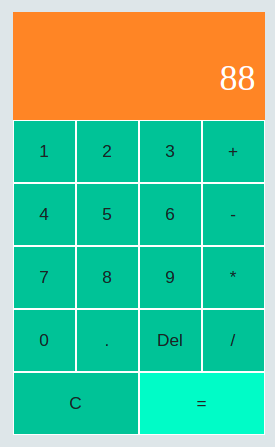

# Classic Calcualtor built using Vanilla Javascript

The Application is a calculator, which uses Vanilla JavaScript. Calculator can sum, devide, multiply or substracts numbers.

<a href="https://bullet03.github.io/calculator_react/">DEMO<a>

- HTML
- CSS/CSS3
- JS (ES6+)
